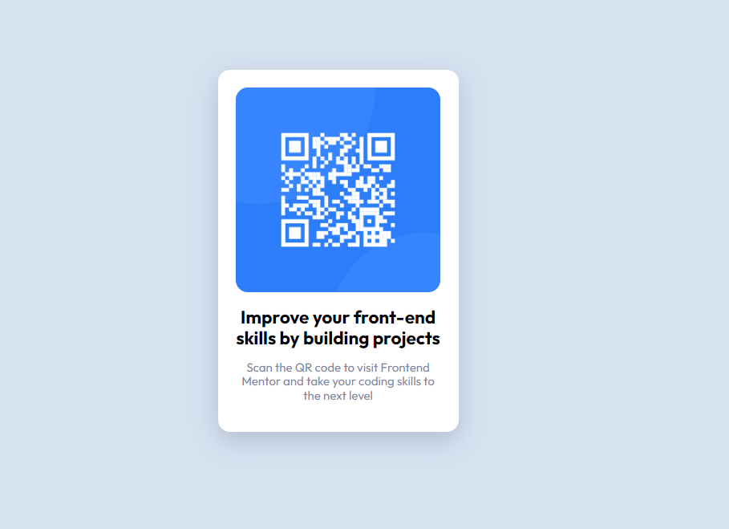

# Frontend Mentor - QR code component solution

This is a solution to the [QR code component challenge on Frontend Mentor](https://www.frontendmentor.io/challenges/qr-code-component-iux_sIO_H).

## Table of contents

- [Overview](#overview)
  - [Screenshot](#screenshot)
  - [Links](#links)
- [My process](#my-process)
  - [Built with](#built-with)
- [Author](#author)

## Overview

I created a responsive QR code compenent based on the images provided with the brief. This simple project uses HTML and CSS with just a single media query for larger screens.

### Screenshot

### Links

- Solution URL: [Solution url](https://github.com/kieranpdev/qr-code-component)
- Live Site URL: [Live site](https://kieranpdev.github.io/qr-code-component/)

## My process

### Built with

- Semantic HTML5 markup
- CSS custom properties
- Mobile-first workflow

## Author

- Kieran price
- Frontend Mentor - [@kieranpdev](https://www.frontendmentor.io/profile/kieranpdev)
